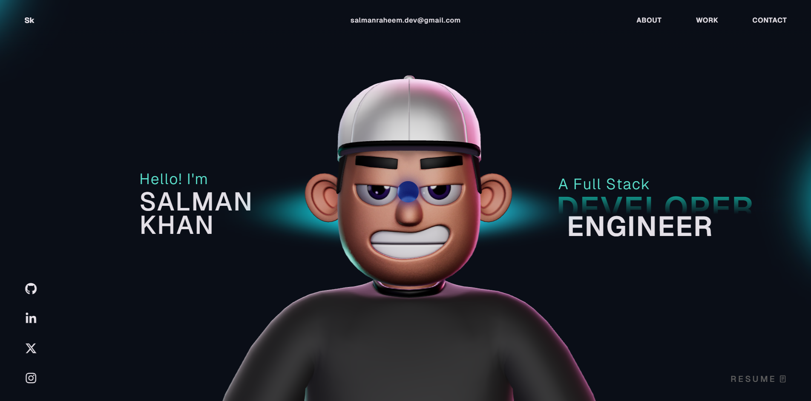

  

<h1 align="center">Hi 👋, I'm Salman Khan</h1>

<h3 align="center">
Full Stack & Blockchain Developer
</h3>

---

## 🚀 About Me

💻 Full Stack Developer with **7+ years experience**  
🔗 Building **Web3 applications and crypto platforms**  
📱 Android native application developer  
🪙 Experienced with **blockchain tokens & decentralized systems**  
🔐 Interested in **security research & system analysis**  
⚡ Passionate about experimenting with new technologies  

---

## 🌐 Connect With Me

🌍 Portfolio: https://salmanraheem-portfolio.vercel.app/  

💼 LinkedIn: https://www.linkedin.com/in/salmanraheem-dev/

🐙 GitHub: https://github.com/salmanraheem-dev  

---

# 🧠 Tech Stack

### Frontend

### Mobile

### Blockchain

### Backend & Database

### Tools

### Design

---

# 📊 GitHub Stats

---

# 🔥 Top Languages

---

# 📈 Activity Graph

---

# 🐍 Contribution Snake

---

# 👀 Profile Views

---

⭐ Explore my repositories to see my work in blockchain, Web3 and modern web development.
